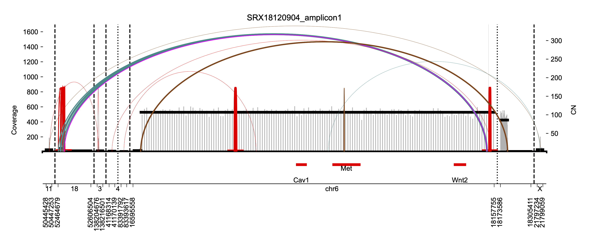
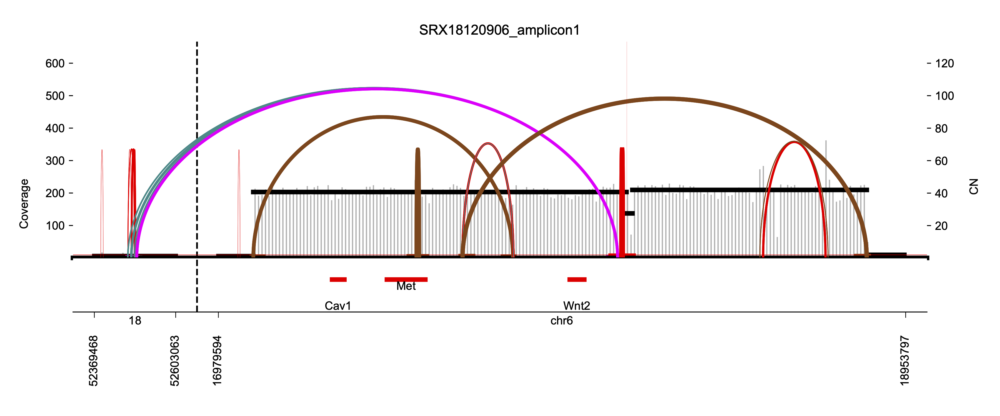

# circdna_e2f5

This repository contains scripts and resources used to identify extrachromosomal DNA (ecDNA) in the MMTV-Cre E2F5-flox mouse model of breast cancer. The analysis leverages the [nf-core/circdna](https://nf-co.re/circdna) pipeline and downstream tools including AmpliconArchitect, CycleViz, and AmpliconReconstructor.

## Repository Structure

```bash
circdna_e2f5/
├── fetchngs_results/         # Metadata and samplesheet for raw data
│   ├── metadata/
│   └── samplesheet/
├── mosek_license_dir/        # MOSEK license required for AmpliconArchitect
├── results/                  # Output from pipeline (e.g., sv_view images)
│   └── ampliconsuite/
├── data_repo/                # Reference data required by AmpliconArchitect (for mm10)
├── run_circdna.sh            # Script to run nf-core/circdna
├── run_fetchngs.sh           # Script to fetch raw fastq files via nf-core/fetchngs
├── icer.config               # Custom config for running on MSU HPCC
├── ids.csv                   # List of run accessions (e.g., SRX IDs)
├── LICENSE
├── README.md
```

## Requirements

- [Nextflow](https://www.nextflow.io/) >= 22.10.1
- [nf-core/fetchngs](https://nf-co.re/fetchngs) and [nf-core/circdna](https://nf-co.re/circdna)
- Singularity (or Docker)
- MOSEK license for AmpliconArchitect
- Reference genome repository for AmpliconArchitect (see below)
- Access to HPC with SLURM (configured in `icer.config`)

## Installation

Clone this repo:

```bash
git clone https://github.com/johnvusich/circdna_e2f5.git
cd circdna_e2f5
```

## Setting up `data_repo` for AmpliconArchitect (mm10)

AmpliconArchitect requires a structured reference data repository to function. This repository follows the naming convention `AA_data_repo`, but here we refer to it as `data_repo`.

To set up the data repo, follow the [official instructions on the AmpliconArchitect GitHub](https://github.com/AmpliconSuite/AmpliconArchitect#setting-up-the-AA-data-repo).

To reproduce this analysis using the mouse mm10 genome, run the following:

```bash
mkdir -p data_repo
echo export AA_DATA_REPO=$PWD/data_repo >> ~/.bashrc
cd $AA_DATA_REPO && touch coverage.stats && chmod a+r coverage.stats
source ~/.bashrc
wget https://datasets.genepattern.org/data/module_support_files/AmpliconArchitect/mm10.tar.gz
tar -xzf mm10.tar.gz
```

### Final Directory Structure Example

```bash
circdna_e2f5/data_repo
├── coverage.stats
├── mm10
│   ├── annotations
│   │   ├── gencode.vM10.basic.annotation_genes.gff
│   │   └── mm10GenomicSuperDup.tab
│   ├── cancer
│   │   ├── oncogene_list.txt
│   │   └── oncogenes
│   │       ├── AC_oncogene_set_mm10.gff
│   │       └── mm10_consensus_oncogenes_list_from_hg19.gff
│   ├── dummy_ploidy.vcf
│   ├── file_list.txt
│   ├── file_sources.txt
│   ├── last_updated.txt
│   ├── mm10-blacklist.v2.bed
│   ├── mm10_centromere.bed
│   ├── mm10_cnvkit_filtered_ref.cnn
│   ├── mm10_conserved_gain5.bed
│   ├── mm10_conserved_gain5_onco_subtract.bed
│   ├── mm10.fa
│   ├── mm10.fa.fai
│   ├── mm10.Hardison.Excludable.full.bed
│   ├── mm10_k35.mappability.bedgraph
│   ├── mm10_merged_centromeres_conserved_sorted.bed
│   ├── mm10_noAlt.fa.fai
│   └── onco_bed.bed
├── mm10.tar.gz
```

Make sure `data_repo` is accessible by the pipeline or container environment and define its path when running AmpliconArchitect manually, or ensure the environment is configured to detect it.

## Step-by-Step Workflow

### 1. Fetch Raw Sequencing Data

Use `run_fetchngs.sh` to download data from SRA using the IDs listed in `ids.csv`.

```bash
sbatch run_fetchngs.sh
```

Edit `samplesheet.csv` and `multiqc_config.yml` as needed in `fetchngs_results/samplesheet/`.

### 2. Run nf-core/circdna

Use `run_circdna.sh` to launch the circular DNA analysis pipeline with AmpliconArchitect.

```bash
sbatch run_circdna.sh
```

This script uses `icer.config` for cluster-specific settings on the MSU HPCC.

### 3. Downstream Analysis

- **CycleViz** and **AmpliconReconstructor** can be run using output files from AmpliconArchitect.
- Visual outputs (e.g., `.png` files) are stored in `results/ampliconsuite/ampliconarchitect/sv_view`.

## Example Output

The following are example structural variant views of predicted circular DNA generated by AmpliconArchitect:

### `SRX18120904_amplicon1.png`


### `SRX18120906_amplicon1.png`


These figures can be found in: `results/ampliconsuite/ampliconarchitect/sv_view/`

## Citation

If you use this code, please cite:

- [nf-core/circdna pipeline](https://nf-co.re/circdna/1.1.0/#citations)
- [AmpliconSuite-pipeline](https://github.com/AmpliconSuite/AmpliconSuite-pipeline/blob/master/CITATIONS.md)

## License

MIT License – see the [LICENSE](./LICENSE) file for details.
